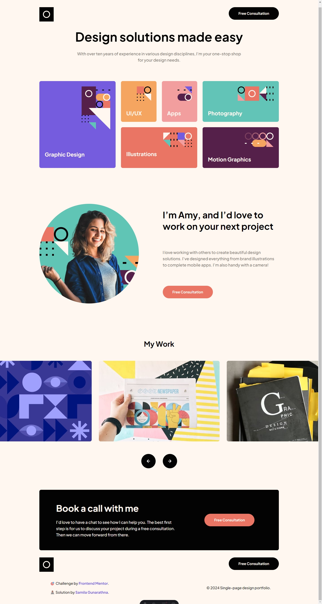
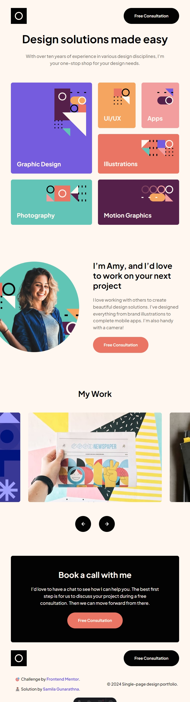

# Frontend Mentor - Single-page design portfolio solution

This is a solution to the [Single-page design portfolio challenge on Frontend Mentor](https://www.frontendmentor.io/challenges/singlepage-design-portfolio-2MMhyhfKVo). Frontend Mentor challenges help you improve your coding skills by building realistic projects.

## Table of contents

- [Overview](#overview)
  - [The challenge](#the-challenge)
  - [Screenshot](#screenshot)
  - [Links](#links)
- [Built with](#built-with)
- [Author](#author)

## Overview

### The challenge

Users should be able to:

- View the optimal layout for the site depending on their device's screen size
- See hover states for all interactive elements on the page
- Navigate the slider using either their mouse/trackpad or keyboard

### Screenshot

### Links

- [Solution Repo](https://github.com/samilaug/single-page-design-portfolio-challenge)
- [Live Site](https://single-page-design-portfolio-challenge-samilag.vercel.app/)

## My process

### Built with

- Semantic HTML5 markup
- Flexbox
- CSS Grid
- Mobile-first workflow
- [Astro](https://astro.build/) - Framework
- [React](https://react.dev/) - React
- [Tailwind CSS](https://tailwindcss.com/) - Styles

## Author

- Frontend Mentor - [@samilaug](https://www.frontendmentor.io/profile/samilaug)
- Linkedin - [samila-gunarathna](https://www.linkedin.com/in/samila-gunarathna/)
